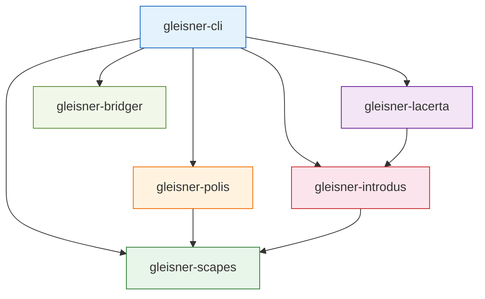
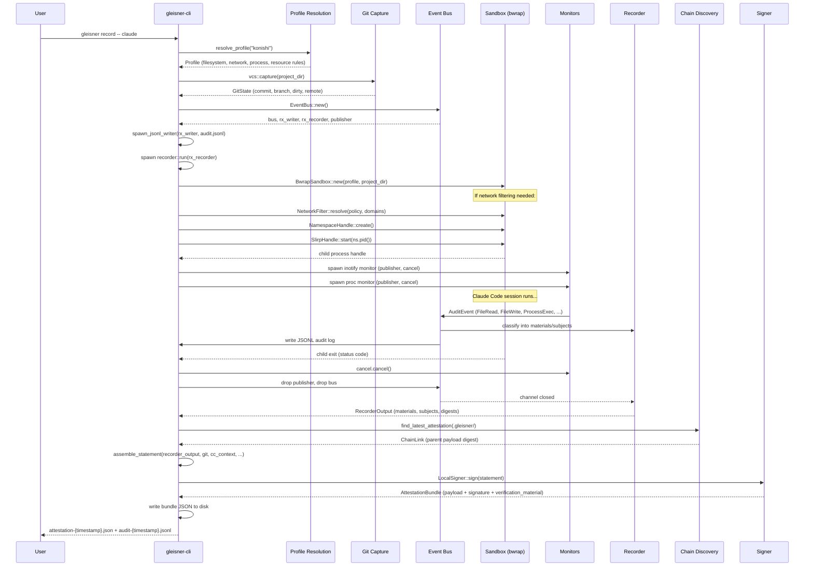
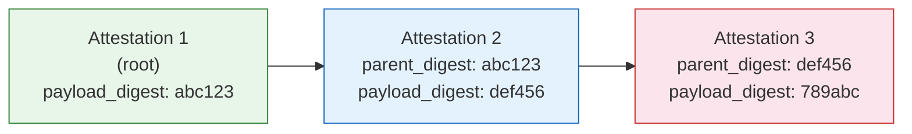
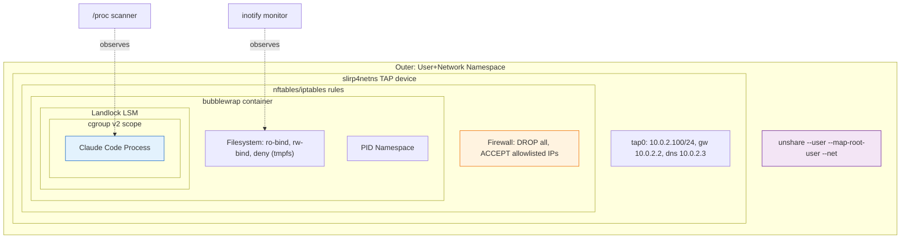
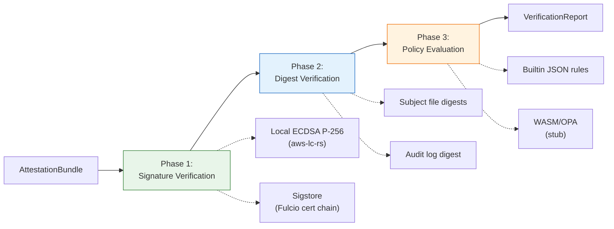
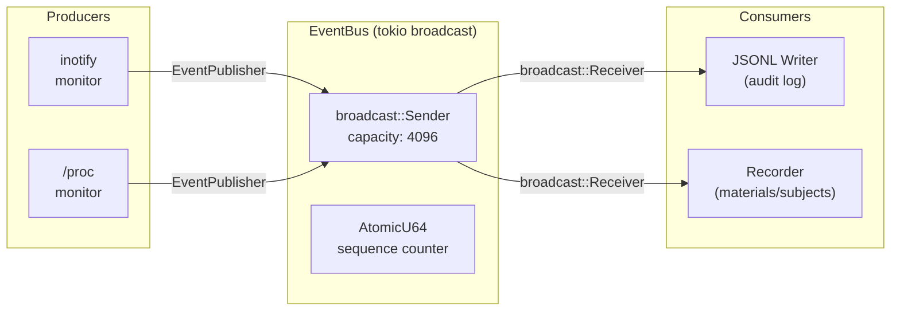

# Gleisner Architecture

Supply chain security for Claude Code sessions. Sandbox every action, attest every output, verify provenance.

Named after the Gleisner robots in Greg Egan's *Diaspora* -- software intelligence housed in constrained physical bodies. The metaphor is precise: Claude Code is a software intelligence; Gleisner gives it a constrained body (sandbox) and an unforgeable record of everything it did (attestation chain).

**Related documents:**
- [SECURITY.md](SECURITY.md) -- cryptographic design, key management, policy
  engine usage, supply chain hardening, security checklist
- [THREAT_MODEL.md](THREAT_MODEL.md) -- threat actors, attack surface analysis,
  LACERTA threat scenarios, mitigations matrix, assumptions

---

## Table of Contents

1. [Overview](#overview)
2. [Workspace Structure](#workspace-structure)
3. [Data Flow](#data-flow)
4. [Attestation Format](#attestation-format)
5. [Chain Verification](#chain-verification)
6. [Sandbox Architecture](#sandbox-architecture)
7. [Verification Pipeline](#verification-pipeline)
8. [Event System](#event-system)
9. [Key Design Decisions](#key-design-decisions)

---

## Overview

Gleisner addresses a specific problem: when an AI coding agent (Claude Code) modifies a codebase, how do you prove what happened? Which files were read, which were written, what network calls were made, and was the agent properly constrained while doing it?

The system provides three capabilities:

1. **Sandboxing** (`gleisner wrap`) -- Run Claude Code inside a bubblewrap/Landlock sandbox with filesystem, network, process, and resource isolation. Credentials are hidden, network is restricted to the Anthropic API, and every file access is monitored.

2. **Attestation** (`gleisner record`) -- Everything above, plus cryptographic attestation. The session produces a signed in-toto v1 statement with SLSA-compatible provenance that records materials (inputs), subjects (outputs), timing, environment metadata, and sandbox configuration. Attestations chain together via parent payload digests.

3. **Verification** (`gleisner verify`) -- Verify signature integrity (ECDSA P-256 or Sigstore), check digest consistency of output files and audit logs, walk the attestation chain, and evaluate configurable policies (JSON rules or WASM/OPA).

Supporting capabilities include SBOM generation (`gleisner sbom`) from Cargo.lock files and attestation inspection (`gleisner inspect`).

---

## Workspace Structure

The project is a Cargo workspace with six crates. All version numbers and lint configuration are centralized in the root `Cargo.toml` via workspace inheritance.

### Crate Map

| Crate | Role | Key Types |
|-------|------|-----------|
| `gleisner-cli` | Binary entry point. CLI parsing, command dispatch, pipeline orchestration. | `RecordArgs`, `WrapArgs`, `VerifyArgs` |
| `gleisner-polis` | Sandbox enforcement. Bubblewrap command construction, Landlock LSM, cgroup v2 resource limits, inotify filesystem monitoring with snapshot reconciliation, `/proc` process monitoring, network filtering. | `BwrapSandbox`, `Profile`, `CgroupScope`, `NetworkFilter`, `NamespaceHandle`, `SlirpHandle` |
| `gleisner-introdus` | Attestation creation. In-toto statement assembly, ECDSA P-256 signing, chain discovery, git state capture, Claude Code context capture, session recording. | `InTotoStatement`, `GleisnerProvenance`, `AttestationBundle`, `LocalSigner`, `ChainLink` |
| `gleisner-lacerta` | Verification. Signature verification (local key + Sigstore), digest checking, policy evaluation (builtin JSON + WASM/OPA), chain walking. | `Verifier`, `VerificationReport`, `BuiltinPolicy`, `WasmPolicy` |
| `gleisner-scapes` | Event infrastructure. Audit event types, broadcast channel event bus, JSONL audit log writer. | `EventBus`, `EventPublisher`, `AuditEvent`, `EventKind`, `JsonlWriter` |
| `gleisner-bridger` | SBOM generation. Cargo.lock parsing, CycloneDX 1.5 JSON output. | `Sbom`, `Component` |

### Dependency Graph



Key observations:

- **`gleisner-scapes`** is the foundation -- it has no internal dependencies and provides the event vocabulary that `polis` and `introdus` both consume.
- **`gleisner-bridger`** is fully independent -- no internal crate dependencies at all. It only needs `serde`, `toml`, and `sha2`.
- **`gleisner-lacerta`** depends on `gleisner-introdus` (for `AttestationBundle` and chain types) but not on `polis` or `scapes`.
- **`gleisner-cli`** is the only crate that depends on everything -- it is the orchestration layer.

---

## Data Flow

The `gleisner record` command orchestrates the complete attestation pipeline. Here is the step-by-step flow:



### Phase-by-Phase Breakdown

**Phase 1: Setup**
- Resolve output paths (`.gleisner/attestation-{timestamp}.json`, `.gleisner/audit-{timestamp}.jsonl`)
- Resolve the sandbox profile by searching `~/.config/gleisner/profiles/`, `./profiles/`, and `/usr/share/gleisner/profiles/`
- Hash the profile TOML for inclusion in the attestation

**Phase 2: Pre-session Capture**
- `ClaudeCodeContext::capture()` reads the Claude Code CLI version, model configuration, and hashes `CLAUDE.md` if present
- `vcs::capture()` uses `gix` to read the HEAD commit, branch, remote URL, and dirty state

**Phase 3: Event Bus Setup**
- Create `EventBus` (tokio broadcast channel, capacity 4096)
- Subscribe two receivers: one for the JSONL audit writer, one for the session recorder
- The JSONL writer flushes after every event for crash consistency
- The recorder classifies events into materials (first digest wins) and subjects (last digest wins)

**Phase 4: Sandbox Spawn**
- Construct `BwrapSandbox` from the profile
- If selective network filtering is needed (network deny + allowed domains): resolve domains to IPs, create user+net namespace, start slirp4netns, wrap bwrap in nsenter
- Otherwise: plain bwrap with `--unshare-net` for full network denial

**Phase 5: Monitoring**
- Capture pre-session filesystem snapshot (hash all project files for later reconciliation)
- Start inotify filesystem monitor (recursive directory watches for file writes, creates, deletes)
- Start `/proc` process monitor (polls process tree rooted at sandbox PID)
- Both publish `AuditEvent`s to the event bus via cloned `EventPublisher` handles
- Optionally create cgroup scope and add the sandbox PID

**Phase 6: Session Execution**
- The sandboxed Claude Code process runs interactively (stdin/stdout/stderr inherited)
- Monitors continuously publish events to the bus
- The JSONL writer and recorder consume events concurrently

**Phase 7: Finalization**
- Cancel monitors via `CancellationToken`
- Drop publishers and bus to close the broadcast channel
- Await recorder completion to get `RecorderOutput`
- Hash the completed audit log file

**Phase 8: Chain and Assembly**
- Scan `.gleisner/` for the most recent `attestation-*.json` file
- Parse it, compute its payload digest, and record as `ChainMetadata`
- Assemble `InTotoStatement` from recorder output, git state, Claude Code context, sandbox summary, and chain metadata

**Phase 9: Signing**
- Load (or generate) ECDSA P-256 key from `~/.config/gleisner/keys/local.pem`
- Sign the canonical JSON payload
- Package into `AttestationBundle` with embedded public key
- Write pretty-printed JSON to disk

---

## Attestation Format

### InTotoStatement

The top-level structure follows the [in-toto v1 Statement specification](https://github.com/in-toto/attestation/blob/main/spec/v1/statement.md):

```json
{
  "_type": "https://in-toto.io/Statement/v1",
  "subject": [
    {
      "name": "/project/src/main.rs",
      "digest": { "sha256": "a1b2c3..." }
    }
  ],
  "predicateType": "https://gleisner.dev/provenance/v1",
  "predicate": { /* GleisnerProvenance */ }
}
```

| Field | Value | Purpose |
|-------|-------|---------|
| `_type` | `https://in-toto.io/Statement/v1` | In-toto v1 statement identifier |
| `subject` | Array of `{name, digest}` | Output artifacts (files written during the session) |
| `predicateType` | `https://gleisner.dev/provenance/v1` | Gleisner-specific provenance predicate |
| `predicate` | `GleisnerProvenance` | The provenance metadata (see below) |

### GleisnerProvenance

The predicate is SLSA v1.0-compatible with Gleisner extensions:

```json
{
  "buildType": "https://gleisner.dev/claude-code/v1",
  "builder": { "id": "gleisner-cli/0.1.0" },
  "invocation": {
    "parameters": { "exit_code": 0, "profile": "konishi" },
    "environment": {
      "tool": "claude-code",
      "claudeCodeVersion": "1.0.0",
      "model": "claude-sonnet-4-20250514",
      "claudeMdHash": "sha256:...",
      "sandboxed": true,
      "profile": "konishi",
      "apiBaseUrl": "https://api.anthropic.com"
    }
  },
  "metadata": {
    "buildStartedOn": "2025-06-01T12:00:00Z",
    "buildFinishedOn": "2025-06-01T12:30:00Z",
    "completeness": {
      "parameters": true,
      "environment": true,
      "materials": false
    }
  },
  "materials": [
    {
      "uri": "git+https://github.com/user/repo.git@abc123",
      "digest": { "sha256": "abc123" }
    },
    {
      "uri": "file:///project/src/lib.rs",
      "digest": { "sha256": "def456" }
    }
  ],
  "gleisner:auditLogDigest": "sha256hex...",
  "gleisner:sandboxProfile": {
    "name": "konishi",
    "profileDigest": "sha256hex...",
    "networkPolicy": "deny",
    "filesystemDenyCount": 7
  },
  "gleisner:chain": {
    "parentDigest": "sha256hex...",
    "parentPath": "attestation-20250601T110000Z.json"
  }
}
```

The `gleisner:` prefixed fields are extensions beyond standard SLSA:

| Extension | Purpose |
|-----------|---------|
| `gleisner:auditLogDigest` | SHA-256 of the JSONL audit log, linking the detailed event stream to the attestation |
| `gleisner:sandboxProfile` | Summary of the sandbox configuration -- profile name, profile file digest, network policy, deny count |
| `gleisner:chain` | Parent attestation link for chain verification (see [Chain Verification](#chain-verification)) |

### AttestationBundle

The bundle wraps the statement with its signature and verification material:

```json
{
  "payload": "{\"_type\":\"https://in-toto.io/Statement/v1\",...}",
  "signature": "base64-encoded-ecdsa-signature",
  "verification_material": {
    "type": "local_key",
    "public_key": "-----BEGIN PUBLIC KEY-----\n..."
  }
}
```

Three verification material variants exist:

| Variant | Content | Use Case |
|---------|---------|----------|
| `local_key` | PEM-encoded ECDSA P-256 public key | Air-gapped environments, local development |
| `sigstore` | Fulcio certificate chain + Rekor log entry ID | Public, keyless signing via Sigstore |
| `none` | Empty | Unsigned bundles (testing, chain bootstrapping) |

The `payload` field is the canonical JSON serialization of the `InTotoStatement`. The signature is computed over this exact string. This is a critical design point -- see [Key Design Decisions](#key-design-decisions).

---

## Chain Verification

Attestations form a linked chain. Each attestation can reference its parent's **payload digest**, creating a verifiable history of Claude Code sessions on a project.

### How Chains Work



1. When `gleisner record` finishes, it scans `.gleisner/` for `attestation-*.json` files
2. Each file is parsed as an `AttestationBundle`, and its `payload` field is SHA-256 hashed
3. The bundle with the latest `metadata.buildFinishedOn` timestamp is selected as the parent
4. The parent's payload digest and file path are stored in `gleisner:chain`

### The walk_chain Algorithm

```
walk_chain(start, dir):
    index = build_digest_index(dir)   // map: payload_digest -> file_path
                                      // duplicates: keeps first, warns about later
    chain = []
    visited = HashSet::new()          // cycle detection
    current = start

    for _ in 0..index.len()+1:        // safety bound prevents infinite loops
        bundle = load(current)
        digest = sha256(bundle.payload)

        if digest in visited:
            warn("cycle detected")
            break                      // cycle in chain

        visited.insert(digest)
        entry = extract_metadata(bundle)
        entry.is_signed = (bundle.verification_material != None)
        if not entry.is_signed:
            warn("unsigned bundle in chain")
        chain.push(entry)

        parent_digest = extract_parent_digest(bundle)
        if parent_digest is None:
            break                      // root of chain
        if parent_digest not in index:
            break                      // broken chain (parent missing)

        current = index[parent_digest]

    return chain                       // newest-first ordering
```

The algorithm pre-loads all bundles in the directory into a digest-indexed `HashMap` for O(1) parent lookup. Duplicate payload digests are handled deterministically (first file wins, duplicates logged as warnings). Chain walks terminate on:
- Reaching a root node (no `gleisner:chain` field)
- A broken chain (parent digest not found in any file)
- A cycle (payload digest already visited)
- The safety bound (prevents infinite loops from malformed chains)

Each `ChainEntry` includes an `is_signed` flag indicating whether the bundle has `VerificationMaterial` other than `None`. Unsigned bundles are logged as warnings during chain walking and flagged as failures during verification.

### Payload Digest vs Bundle Digest

The chain links on the **payload digest** (SHA-256 of the `payload` JSON string), not the digest of the entire bundle file. This is deliberate -- see [Key Design Decisions](#key-design-decisions).

---

## Sandbox Architecture

The sandbox uses multiple Linux security mechanisms in layers:



### Layer 1: Bubblewrap (bwrap)

Bubblewrap creates unprivileged Linux containers using user namespaces. The `BwrapSandbox` struct translates a `Profile` into bwrap command-line arguments:

- **Filesystem isolation**: System paths (`/usr`, `/lib`, `/etc`, `/bin`) are bind-mounted read-only. The project directory is read-write. Sensitive paths (`~/.ssh`, `~/.aws`, `~/.gnupg`, etc.) are shadowed with empty tmpfs mounts. Argument order matters: deny tmpfs overlays must come after readonly binds to properly shadow them.
- **PID namespace**: `--unshare-pid` gives the sandbox its own PID namespace. The sandboxed process sees itself as PID 1.
- **Privilege escalation prevention**: `--new-session` creates a new session, preventing `TIOCSTI` terminal injection.
- **Orphan prevention**: `--die-with-parent` ensures the sandbox is killed if the parent gleisner process dies.

### Layer 2: Network Filtering

Two modes:

**Full denial** (simple case): When `network.default = "deny"` with no `allow_domains`, bwrap uses `--unshare-net` to create an empty network namespace. No network access at all.

**Selective filtering** (complex case): When `allow_domains` are specified alongside `network.default = "deny"`:

1. **Domain resolution**: Before sandbox entry, domains are resolved to IP addresses via `ToSocketAddrs` while the host network is still available. Partial resolution failures are tolerated.

2. **Namespace creation**: `unshare --user --map-root-user --net -- sleep infinity` creates a long-lived user+network namespace pair. The `sleep` process holds the namespaces open.

3. **slirp4netns**: Starts a userspace TCP/IP stack that creates a `tap0` device inside the network namespace. The sandbox gets addresses `10.0.2.100/24` with gateway `10.0.2.2` and DNS `10.0.2.3`.

4. **Firewall rules**: The inner command is wrapped in a shell script that auto-detects the firewall backend:
   - **nftables** (preferred): Creates an `inet gleisner` table with output policy `drop`, loopback accept, optional DNS accept, and per-IP+port accept rules
   - **iptables** (fallback): Sets `OUTPUT DROP`, adds loopback and per-IP rules. Also blocks IPv6 via `ip6tables`
   - If neither works, the sandbox refuses to start

5. **nsenter**: The bwrap command is wrapped with `nsenter --user=... --net=... --preserve-credentials --no-fork` to enter the pre-created namespace instead of using `--unshare-net`.

Why not just `--unshare-net` with external slirp4netns? Because bwrap implicitly creates a user namespace when run unprivileged, and network namespaces are owned by their creating user namespace. slirp4netns running in the init user namespace cannot `setns(CLONE_NEWNET)` into bwrap's namespace without `CAP_SYS_ADMIN` in the owning user namespace. Creating the namespaces first lets slirp4netns attach before bwrap starts.

### Layer 3: Cgroup v2 Resource Limits

The `CgroupScope` creates a dedicated cgroup under `/sys/fs/cgroup/gleisner-{id}/` and writes control files:

| Control File | Source | Effect |
|-------------|--------|--------|
| `memory.max` | `max_memory_mb * 1024 * 1024` | Hard memory limit |
| `cpu.max` | `"(max_cpu_percent * 1000) 100000"` | CPU quota per 100ms period |
| `pids.max` | `max_pids` | Maximum process count |

Zero values are treated as "no limit" -- if a resource field is `0`, the corresponding cgroup control is not written and a warning is logged. This prevents accidental denial-of-service from writing `0` to `memory.max` (which would mean zero bytes allowed) or `pids.max` (which would prevent any process creation).

On drop, processes are migrated to the parent cgroup and the directory is removed.

### Layer 4: Monitoring

**Inotify filesystem monitor**: Uses the `notify` crate (inotify backend on Linux) for recursive directory watching. Runs in a `spawn_blocking` thread with `recv_timeout` for cancellation. For each event:
- Filters out ignored patterns (`target/`, `.git/`, `node_modules/`, `.gleisner/`)
- Hashes file content via SHA-256 on write-close and create
- Publishes `FileWrite` (on close-write or create) and `FileDelete` events
- Requires no special capabilities — works as any unprivileged user

**Snapshot reconciliation**: Before the session starts, hashes all files in the project directory to create a baseline. After the session ends, creates a second snapshot and diffs against the baseline. Any file changes not already reported by the real-time inotify monitor are synthesized as events. This provides stronger completeness guarantees than real-time monitoring alone.

**Process monitor**: Polls `/proc` at configurable intervals to detect process creation and exit within the sandbox process tree. Uses `/proc/{pid}/task/{pid}/children` (fast path) with fallback to scanning `/proc/*/stat` for matching PPIDs. Publishes `ProcessExec` and `ProcessExit` events.

### Sandbox Profiles

Profiles are TOML files defining all four isolation dimensions:

```toml
name = "konishi"
description = "Default balanced profile"

[filesystem]
readonly_bind = ["/usr", "/lib", "/lib64", "/etc", "/bin", "/sbin", "/opt"]
readwrite_bind = []
deny = ["~/.ssh", "~/.aws", "~/.gnupg", "~/.config/gcloud", "~/.azure", "~/.kube", "~/.docker"]
tmpfs = ["/tmp"]

[network]
default = "deny"
allow_domains = ["api.anthropic.com", "sentry.io"]
allow_ports = [443]
allow_dns = true

[process]
pid_namespace = true
no_new_privileges = true
command_allowlist = []

[resources]
max_memory_mb = 4096
max_cpu_percent = 100
max_pids = 256
max_file_descriptors = 1024
max_disk_write_mb = 10240
```

The three bundled profiles (named after polises in *Diaspora*):
- **konishi** -- Default balanced. Anthropic API only, credentials hidden, PID isolated.
- **carter-zimmerman** -- Exploratory. Broader network access for projects needing external APIs.
- **ashton-laval** -- Strict. Minimal permissions, tighter resource limits.

Profile resolution searches: direct TOML path, `~/.config/gleisner/profiles/`, `./profiles/`, `/usr/share/gleisner/profiles/`.

---

## Verification Pipeline

The `Verifier` orchestrates three verification phases in sequence:



### Phase 1: Signature Verification

Dispatches based on `VerificationMaterial` type:

- **LocalKey**: Decodes the base64 signature, extracts the raw EC point from the SPKI-encoded public key (stripping the fixed 26-byte ASN.1 header), and verifies with `aws-lc-rs` `ECDSA_P256_SHA256_ASN1`.
- **Sigstore**: Parses the leaf X.509 certificate from the PEM chain, extracts its SubjectPublicKeyInfo DER, builds a `CosignVerificationKey`, and verifies the signature. Rekor log entry is recorded but not verified online.
- **None**: Fails verification (unsigned bundle).

A public key override can be provided to verify against a specific key instead of the embedded material.

### Phase 2: Digest Verification

Two optional checks:

- **Subject digests**: If `--check-files --base-dir` is provided, each subject in the statement is looked up on disk and its SHA-256 is compared against the attested digest.
- **Audit log digest**: If `--audit-log` is provided, the file is hashed and compared to `gleisner:auditLogDigest`.

Both are skipped (not failed) when the corresponding paths are not provided.

### Phase 3: Policy Evaluation

The `PolicyEngine` trait defines a pluggable evaluation interface:

```rust
pub trait PolicyEngine: Send + Sync {
    fn evaluate(&self, input: &PolicyInput) -> Result<Vec<PolicyResult>, VerificationError>;
}
```

**BuiltinPolicy** (JSON): All rules are opt-in via `Option` fields. Absent rules are skipped, not failed:

| Rule | Input | Effect |
|------|-------|--------|
| `require_sandbox` | `sandboxed` bool | Require session was sandboxed |
| `allowed_profiles` | `sandbox_profile` name | Restrict to named profiles |
| `max_session_duration_secs` | Computed from timestamps | Cap session length (must be positive; non-positive values produce a validation failure) |
| `require_audit_log` | `has_audit_log` | Require audit log present |
| `allowed_builders` | `builder_id` | Restrict builder identity |
| `require_materials` | `has_materials` | Require input materials |
| `require_parent_attestation` | `has_parent_attestation` | Require chain continuity |

**WasmPolicy** (WASM/OPA): Module loading via `wasmtime` is implemented, but the OPA ABI evaluation is not yet complete (the OPA ABI for WASM involves complex memory management and JSON serialization protocol). The builtin engine covers immediate needs.

### Chain Verification

When `--check-chain` is enabled, the verifier walks the attestation chain via `walk_chain()` and validates:
- Each link's parent digest matches the actual payload digest of the referenced parent bundle
- No unsigned links exist in the chain (bundles with `VerificationMaterial::None` produce a `Fail` outcome)
- The chain is cycle-free (cycle detection via visited digest tracking in `walk_chain()`)

### VerificationReport

Each check produces a `VerificationOutcome`:
- **Pass**: Check succeeded with a message
- **Fail**: Check failed with a message
- **Skip**: Check was not applicable (insufficient information)

The overall `passed` flag is `true` only if there are zero `Fail` outcomes.

---

## Event System

`gleisner-scapes` provides the shared event vocabulary and async distribution infrastructure.

### Event Types

```rust
pub enum EventKind {
    FileRead { path, sha256 },
    FileWrite { path, sha256_before, sha256_after },
    FileDelete { path, sha256_before },
    ProcessExec { command, args, cwd },
    ProcessExit { command, exit_code },
    NetworkConnect { target, port },
    NetworkDns { query, results },
    EnvRead { key, value_sha256 },  // never logs raw values
}
```

Each event also carries:
- `timestamp`: `DateTime<Utc>` -- when the event occurred
- `sequence`: `u64` -- monotonically increasing, assigned by the event bus
- `result`: `Allowed` or `Denied { reason }` -- whether the sandbox policy permitted it

Security note: `EnvRead` only records a SHA-256 digest of the environment variable value, never the raw value. This prevents API keys and secrets from appearing in audit logs.

### Event Bus Architecture



Key properties:

- Built on `tokio::sync::broadcast` -- each consumer gets an independent `Receiver` and processes events at its own pace
- `EventPublisher` is `Clone + Send` -- safe to send into `spawn_blocking` or other background tasks
- Monotonic sequence numbers are assigned atomically (`AtomicU64`) at publish time, shared across all publishers
- If a slow consumer falls behind the 4096-event buffer, it receives a `Lagged` error and skips to the most recent event (graceful degradation, not crash)
- The channel closes when all senders are dropped, which triggers consumer finalization

### JSONL Audit Writer

The `JsonlWriter` serializes each event as a single JSON line followed by a newline, then flushes immediately. This ensures crash-consistent audit trails -- every event that was written is durable on disk. The writer uses `BufWriter` for efficiency but flushes per-event for safety.

### Session Recorder

The recorder consumes events and classifies them:
- **Materials** (inputs): Keyed by file path. First digest wins (captures initial state before modifications).
- **Subjects** (outputs): Keyed by file path. Last digest wins (captures final state after all modifications).
- Other event types (processes, network, env) are counted but not classified as materials/subjects.

On channel close, the recorder hashes the completed audit log file and returns a `RecorderOutput` containing the classified materials, subjects, event count, audit log digest, and timing.

---

## Key Design Decisions

### Why Payload Digest for Chains, Not Bundle Digest

The chain links on `SHA-256(bundle.payload)`, not `SHA-256(entire_bundle_json)`. This means re-signing a statement (e.g., rotating keys or switching from local to Sigstore signing) does not break the chain. The payload contains the attestation content; the bundle wraps it with signing metadata. The content is what matters for provenance continuity. Re-keying is a legitimate operational need that should not invalidate the attestation history.

### Why Bubblewrap Over Other Sandboxing

Several options were considered:

| Option | Verdict | Reason |
|--------|---------|--------|
| **bubblewrap** | Chosen | Unprivileged (no root needed), mature, widely packaged, simple CLI interface, composable with other namespace tools |
| Docker/Podman | Rejected | Heavyweight, requires daemon or rootless setup, overkill for wrapping a single interactive CLI process |
| Firejail | Rejected | Less composable, historically had security issues, less widely deployed |
| Raw namespaces | Rejected | Too low-level, would duplicate what bwrap already provides robustly |
| Flatpak | Rejected | Designed for GUI applications, wrong abstraction level |

Bubblewrap's key advantage is that it works unprivileged (via user namespaces) and produces a single process tree that is easy to monitor and control.

### Why In-Toto / SLSA Format

The attestation format follows [in-toto v1](https://in-toto.io/) with [SLSA v1.0 provenance](https://slsa.dev/spec/v1.0/provenance) extensions because:

1. **Ecosystem compatibility**: Tools like `cosign`, `in-toto-verify`, and SLSA verifiers can parse the standard fields. The `gleisner:` extensions are ignored by tools that don't know about them.
2. **Materials/subjects model**: In-toto's input/output model maps naturally to "files Claude Code read" (materials) and "files Claude Code wrote" (subjects).
3. **Predicate extensibility**: The predicate type system allows Gleisner-specific metadata without conflicting with standard fields.
4. **Industry adoption**: SLSA is becoming the standard for software supply chain provenance. Using it means attestations can be consumed by CI/CD systems, package registries, and audit tools.

### Why ECDSA P-256 and aws-lc-rs

- **P-256**: The most widely supported elliptic curve. Sigstore uses it, most HSMs support it, and key sizes are practical (32-byte private keys, 65-byte uncompressed public keys).
- **aws-lc-rs**: Formally verified C crypto from AWS-LC, with FIPS 140-3 certification. The `ring` API compatibility layer makes it a drop-in. Post-quantum signing (ML-DSA / FIPS 204) can be added when the verification ecosystem supports it.
- **`unsafe_code = "forbid"`**: The workspace forbids unsafe Rust. All unsafe operations are inside `aws-lc-rs` (audited, formally verified C code via FFI).

### Why Separate Event Bus, Not Direct Logging

The event bus (`gleisner-scapes`) decouples event production from consumption:

- Monitors do not need to know about audit files or attestation formats
- New consumers (TUI viewer, real-time alerting, network logger) can be added by subscribing to the bus
- The recorder can classify events into materials/subjects without the JSONL writer needing to understand that classification
- Testing is easier: tests can subscribe to the bus and assert on events without touching the filesystem

### Why Profiles Are TOML Files, Not CLI Flags

A security configuration has many interdependent parameters (filesystem rules, network rules, resource limits). Encoding this as CLI flags would be error-prone and non-reproducible. TOML profiles:

- Are versionable in git alongside the project
- Can be audited and reviewed in PRs
- Are self-documenting (the profile file is the specification)
- Enable the attestation to include the profile digest, proving which exact configuration was used
- Support organizational standardization (deploy profiles to `/usr/share/gleisner/profiles/`)

### Why materials: false in Completeness

The `completeness.materials` field is always `false` because the filesystem monitor cannot guarantee it captured every file read. The inotify real-time monitor primarily tracks writes (creates, modifications, deletions). Reads are partially captured via the before/after snapshot reconciliation (files whose metadata changed) but reads from memory-mapped files, inherited file descriptors, or pipes are invisible. For *write completeness*, the snapshot reconciliation provides a strong guarantee: any file that changed during the session will be detected in the before/after diff even if inotify missed the real-time event. The SLSA spec explicitly supports this partial completeness.
